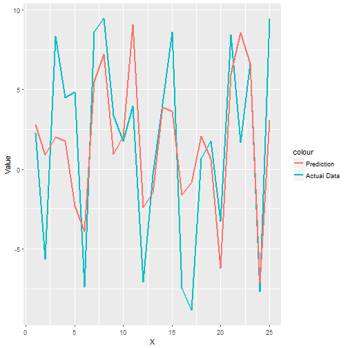

Shiny Application: The Illustration of Overfitting
========================================================
author: Petr Minin
date: 15.02.2018
autosize: true

The Idea
========================================================

The application illustrates the following idea:
when you have a large number of predictors that have no influence upon the value you are trying to predict, you will almost certainly find several predictors, that are correlated with the predicted value and they will enable you to build a model, that will look good, but will have no value at all.

The Input
========================================================

You can set the seed by moving the slider in the sidebar.
Each time you move the slider, the code is run and the new output is created.

The Code
========================================================

Whenever you set the seed with a slider:
- 51 sets of 25 random uniforms are generated,
- 1 set is used as a Training set, 
- Out of the other 50 sets 3 are selected, that have the smallest p.value when building a linear model,
- A linear model is built using these 3 sets of random numbers,
- The plot in the main panel shows the Training set and Prediction followed by R-squared.

The Output
========================================================
There are 2 outputs:

- A plot in the main panel shows the Training set and Prediction.  
- R-squared for the model is shown under the plot.

An Example of the output (seed=250)

